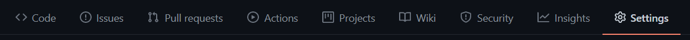
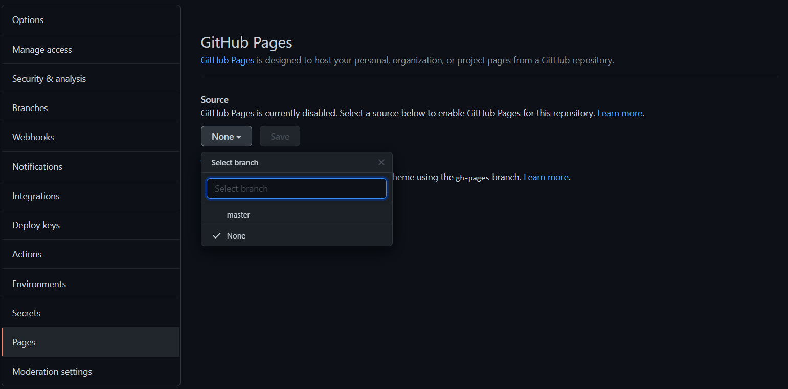
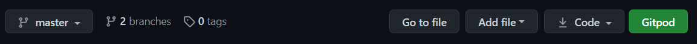
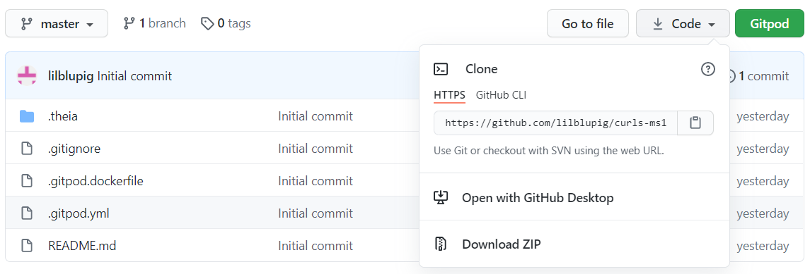

# React Tutorial Tic-Tac-Toe

Following the Official React Tutorial at https://reactjs.org/tutorial/tutorial.html to create an interactive game of Tic-Tac-Toe which tracks changes to the board and utilises "time travel" to enable the users to reset the board back to any move.

# Index
1. [UX](#ux)
1. [Features](#features)
    * [Existing Features](#existing-features)
    * [Features for Future Implementation](#features-for-future-implementation)
1. [Testing](#testing)
1. [Development Life Cycle](#development-life-cycle)
1. [Technologies Used](#technologies-used)
1. [Deployment](#deployment)
    * [Via GitPod](#deployment-of-the-page)
    * [Cloning Locally](#how-to-run-the-code-locally)
1. [Credits](#credits)
    * [Website](#website-credits)
    * [README](#readme-credits)
1. [Create React App Info](#getting-started-with-create-react-app)

## UX

### **Overview and Broad Design Choices**
The website is the result of an educational tutorial for the framework React.  The website exists as a facility to learning the framework and therefore the designers would have built it accordingly.

## Features

### **Existing Features**
The game is interactive and allows players to track moves, and go back to any turn and continue on, should they wish to do so.  The game features a turn-tracker which updates for each click and announces the winner - if any.

### **Features for Future Implementation**
A number of changes remain according to the tutorial.

Improvements that you could make to the tic-tac-toe game which are listed in order of increasing difficulty:

0. Display the location for each move in the format (col, row) in the move history list.
0. Bold the currently selected item in the move list.
0. Rewrite Board to use two loops to make the squares instead of hardcoding them.
0. Add a toggle button that lets you sort the moves in either ascending or descending order.
0. When someone wins, highlight the three squares that caused the win.
0. When no one wins, display a message about the result being a draw.

## Testing
Incremental testing was undertaken using the local port 3000 and Chrome Developer Tools throughout production.  The [React Dev Tools](https://chrome.google.com/webstore/detail/react-developer-tools) plugin was installed to assist with this.

## Development Life Cycle
The website was constructed via a step-by-step guide, though some bugs were encountered still.  The most notable of these was the misuse of commas and semi-colons in JSX syntax.

Commits were made as each section of each page was added and pushed once a section was complete.

The project was deployed using GitHub pages once the basic structure of the page was complete.  This allowed for continuous delivery as each change was made, and pushed and enabled testing of the page during development on different devices.

## Technologies Used

### **Languages**
* HTML5 is used to provide the basic structure of the website.
  * About: [HTML5 Wiki](https://en.wikipedia.org/wiki/HTML5)
  * Creator: [W3 Consortium](https://www.w3.org/)
* CSS3 is used to provide most of the styling for the website.
  * About: [CSS3 Wiki](https://en.wikipedia.org/wiki/CSS)
  * Creator: [W3 Consortium](https://www.w3.org/)
* JavaScript elements are used via Bootstrap and directly for modal validation.
  * About: [JavaScript Home](https://www.javascript.com/)
* JSX is used to facilitate the use of React.
  * About: [React JSX](https://www.w3schools.com/react/react_jsx.asp)

### **Libraries and Frameworks**
* [React](https://reactjs.org/) is used to build the entire game, with a little css alongside.

### **Tools**
* [node.js](https://nodejs.org/en/) is required to work with React in a local IDE.
* [Git](https://git-scm.com/)/[GitHub](https://github.com/) were used for version control and repository storage.
* [Atom](https://atom.io/) was the IDE used to write the project.
* [Chrome Dev Tools](https://developers.google.com/web/tools/chrome-devtools) and the [React extension](https://chrome.google.com/webstore/detail/react-developer-tools) were used for bug fixing.

### **Other Resources**
* [Code Institute Full Template](https://github.com/Code-Institute-Org/gitpod-full-template) was used to set up the repository.

## Deployment
The website was created using [GitPod](https://www.gitpod.io/). Version control was undertaken by committing to [Git](https://git-scm.com/) and pushing to [GitHub](https://github.com/) using the functions within GitPod.

### **Deployment of the Page**
1. In the IDE, ensure the tree is clean, and all required items have been committed and pushed to the repository in GitHub.
1. Sign in to GitHub.
1. Navigate to the appropriate repository: [React Tutorial](https://github.com/lilblupig/react-tutorial)
1. From the repository menu, choose Settings.

1. On the sidebar menu to the left, find the Pages section.
1. From the first dropdown box, choose the Master branch, then click save.

1. The page will refresh, and the Pages section now shows a URL for the deployed site.
1. Click the URL to view the deployed website.

### **How to Clone and Run the Code Locally**
There are slightly different approaches should you choose to use GitPod to clone the project, or a local IDE.

#### Cloning a Project into GitPod
1. Use [Google Chrome](https://www.google.com/intl/en_uk/chrome/). *(This can also be undertaken in Firefox)*
1. If you do not already have one, [create a GitHub account](https://github.com/join).
1. Install the [GitPod browser extension for Chrome](https://chrome.google.com/webstore/detail/gitpod-dev-environments-i/). *(Or Firefox if appropriate)*
1. Restart Chrome.
1. In GitHub, find the [project repository](https://github.com/lilblupig/react-tutorial).
1. From the repository menu, choose the green GitPod button.

1. A new GitPod workspace will open containing the project code.

#### Cloning a Project into a Local IDE
1. Navigate to the [GitHub Repository](https://github.com/lilblupig/react-tutorial).
1. Choose the Code dropdown menu, and copy the URL.

1. Open your local IDE and then open a terminal.
1. Set the current working directory to your preferred location for the cloned project.
1. Type in "git clone " followed by the copied URL. Be sure to include a space between git clone and the url, then press enter.
1. The cloned project will be created.

You can find more information on cloning a repository from GitHub [here](https://docs.github.com/en/github/creating-cloning-and-archiving-repositories/cloning-a-repository).

## Credits

### **Website Credits**

#### Content
The website is a carbon copy of the [React Tutorial](https://reactjs.org/tutorial/tutorial.html).

#### Media
* No media was used for the website.

### **README Credits**

#### Content
Structure and content based heavily on:
* [Code Institute Solutions - README Template](https://github.com/Code-Institute-Solutions/readme-template)

#### Media
The images for this README are from the following sources:
* Snips taken from GitHub.
* [Am I Responsive](http://ami.responsivedesign.is/).

#### Other
* Markdown basic taken from [Mastering Markdown](https://guides.github.com/features/mastering-markdown/).

## Getting Started with Create React App

This project was bootstrapped with [Create React App](https://github.com/facebook/create-react-app).

### Available Scripts

In the project directory, you can run:

#### `yarn start`

Runs the app in the development mode.\
Open [http://localhost:3000](http://localhost:3000) to view it in the browser.

The page will reload if you make edits.\
You will also see any lint errors in the console.

#### `yarn test`

Launches the test runner in the interactive watch mode.\
See the section about [running tests](https://facebook.github.io/create-react-app/docs/running-tests) for more information.

#### `yarn build`

Builds the app for production to the `build` folder.\
It correctly bundles React in production mode and optimizes the build for the best performance.

The build is minified and the filenames include the hashes.\
Your app is ready to be deployed!

See the section about [deployment](https://facebook.github.io/create-react-app/docs/deployment) for more information.

#### `yarn eject`

**Note: this is a one-way operation. Once you `eject`, you can’t go back!**

If you aren’t satisfied with the build tool and configuration choices, you can `eject` at any time. This command will remove the single build dependency from your project.

Instead, it will copy all the configuration files and the transitive dependencies (webpack, Babel, ESLint, etc) right into your project so you have full control over them. All of the commands except `eject` will still work, but they will point to the copied scripts so you can tweak them. At this point you’re on your own.

You don’t have to ever use `eject`. The curated feature set is suitable for small and middle deployments, and you shouldn’t feel obligated to use this feature. However we understand that this tool wouldn’t be useful if you couldn’t customize it when you are ready for it.

### Learn More

You can learn more in the [Create React App documentation](https://facebook.github.io/create-react-app/docs/getting-started).

To learn React, check out the [React documentation](https://reactjs.org/).

#### Code Splitting

This section has moved here: [https://facebook.github.io/create-react-app/docs/code-splitting](https://facebook.github.io/create-react-app/docs/code-splitting)

#### Analyzing the Bundle Size

This section has moved here: [https://facebook.github.io/create-react-app/docs/analyzing-the-bundle-size](https://facebook.github.io/create-react-app/docs/analyzing-the-bundle-size)

#### Making a Progressive Web App

This section has moved here: [https://facebook.github.io/create-react-app/docs/making-a-progressive-web-app](https://facebook.github.io/create-react-app/docs/making-a-progressive-web-app)

#### Advanced Configuration

This section has moved here: [https://facebook.github.io/create-react-app/docs/advanced-configuration](https://facebook.github.io/create-react-app/docs/advanced-configuration)

#### Deployment

This section has moved here: [https://facebook.github.io/create-react-app/docs/deployment](https://facebook.github.io/create-react-app/docs/deployment)

#### `yarn build` fails to minify

This section has moved here: [https://facebook.github.io/create-react-app/docs/troubleshooting#npm-run-build-fails-to-minify](https://facebook.github.io/create-react-app/docs/troubleshooting#npm-run-build-fails-to-minify)

**This website was produced as an educational project.**

**Created by Amy Hacker.**

[Back to Top](#react-tutorial-tic-tac-toe)
